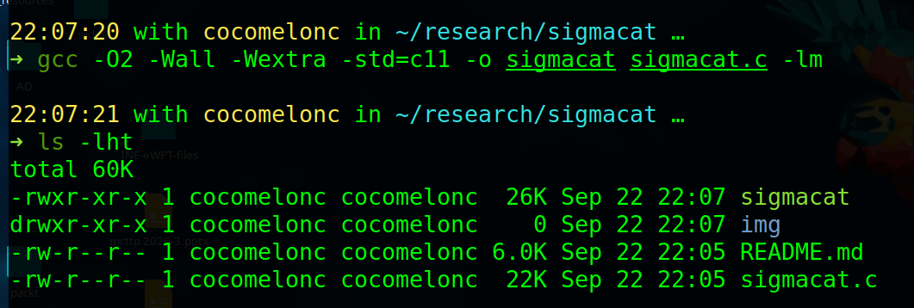
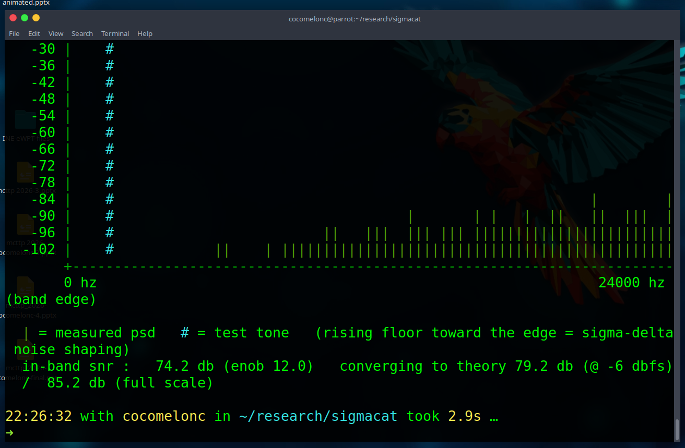
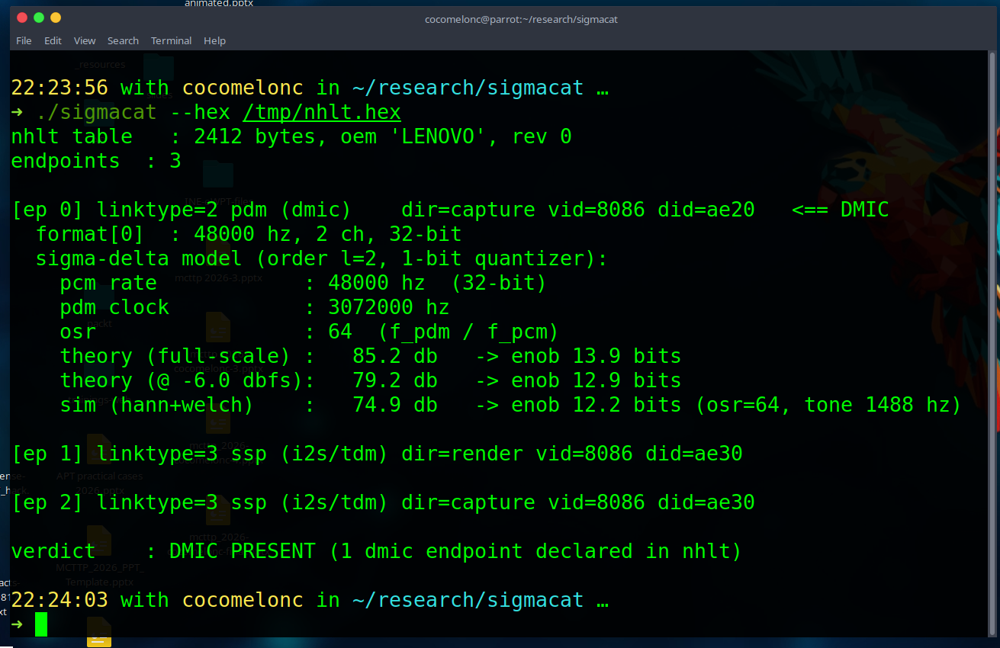

# sigmacat

single-file C tool that parses the ACPI *NHLT* (Non-HDA Link Table), reports every audio endpoint, and flags digital microphones - plus the math behind what a DMIC actually is.

## what it does

**detect DMIC.** in NHLT every endpoint carries a `LinkType` byte. a DMIC is a **PDM** link (`LinkType == 2`). the parser follows the NHLT layout by exact offsets - the 36-byte ACPI header, the endpoint-count byte, then each endpoint descriptor whose `Length` field (offset 0) spans the whole descriptor, so you hop endpoint->endpoint by it. it also decodes the advertised audio format(s) (rate / channels / depth).

**model the DMIC.** a DMIC is physically a *1-bit sigma-delta (ΔΣ) modulator* emitting a PDM stream that is decimated to PCM. from the format NHLT declares, sigmacat computes:

- oversampling ratio $\mathrm{OSR} = f_\mathrm{pdm} / f_\mathrm{pcm}$
- closed-form peak SNR of an ideal $L$-th order, $N$-bit modulator:

$$
\mathrm{SNR}_\mathrm{dB} = 6.02\,N + 1.76 + 10\log_{10}\!\left(\frac{2L+1}{\pi^{2L}}\right) + 10\,(2L+1)\log_{10}(\mathrm{OSR})
$$

  which follows from shaping the quantization noise by $\mathrm{NTF}(z) = (1 - z^{-1})^{L}$ and integrating $|\mathrm{NTF}(e^{j\omega})|^2$ over the in-band region $[0, f_\mathrm{pcm}/2]$. the effective resolution is then

$$
\mathrm{ENOB} = \frac{\mathrm{SNR}_\mathrm{dB} - 1.76}{6.02}
$$

- a *live time-domain simulation*: a 2nd-order 1-bit modulator on a test tone $\rightarrow$ sinc³ (CIC) decimator $\rightarrow$ *Welch-averaged, Hann-windowed periodogram* (radix-2 FFT) that measures the real in-band SNR and confirms the analytical number.

because the 1-bit loop must run below full scale to stay stable, the peak-SNR theory is also reported scaled by the input backoff $20\log_{10}(A/A_\mathrm{FS})$ - the ΔΣ noise floor is set by the modulator/OSR, not the signal, so SNR tracks input level dB-for-dB:

$$
\mathrm{SNR}(A) = \mathrm{SNR}_\mathrm{peak} + 20\log_{10}\!\left(\frac{A}{A_\mathrm{FS}}\right)
$$

how to compile (libc + libm only):       

```bash
gcc -O2 -Wall -Wextra -std=c11 -o sigmacat sigmacat.c -lm
```

     

run

```bash
sudo ./sigmacat                 # read /sys/firmware/acpi/tables/NHLT (root)
./sigmacat --raw dump.bin       # raw binary nhlt blob
./sigmacat --hex /tmp/nhlt.hex  # an `xxd` hexdump
./sigmacat --demo               # no hardware: model a 48k/16-bit dmic
./sigmacat --viz                # live spectrum of the synthetic model
./sigmacat --wav rec.wav        # live spectrum + descriptors of real audio
./sigmacat --scan dir/          # scan a dataset of .wav files
./sigmacat ... --pdm-clock 3072000
```

     

original firmware-forensics flow:     

```bash
sudo xxd /sys/firmware/acpi/tables/NHLT > /tmp/nhlt.hex
./sigmacat --hex /tmp/nhlt.hex
```

     

## simulation vs. theory

for a 48 kHz / OSR 64 DMIC at $A/A_\mathrm{FS}=0.5$ (−6 dBFS):

| quantity | value |
|---|---|
| theory, full-scale peak | ≈ 85.2 dB (ENOB ≈ 13.9) |
| theory, at −6 dBFS input | ≈ 79.2 dB (ENOB ≈ 12.9) |
| simulation (Hann + Welch) | ≈ 74.9 dB (ENOB ≈ 12.2) |

Hann windowing + Welch averaging pulled the measured SNR from ~59 dB (single rectangular DFT, dominated by spectral leakage and periodogram variance) to within ~4 dB of the input-scaled theory. the residual is genuine, not a measurement artifact: the sinc³ CIC decimator folds a little out-of-band shaped noise back in-band and droops the passband. matching the decimator order to the modulator ($L{+}1$ stages) and adding droop compensation is the next DSP step.

LinkType codes: `0` hd-audio, `1` dsp, `2` *pdm/dmic*, `3` ssp/i2s, `4` slimbus, `5` soundwire.

## real data & datasets

the same DSP core runs on real recordings, closing the loop: NHLT says a DMIC
exists → capture from it → look at what it actually produces. capture the raw
PDM-backed endpoint (or the default mic) with ALSA, then analyze:

```bash
arecord -D hw:0,6 -f S32_LE -r 48000 -c 2 -d 5 dmic.wav   # card 0, device 6 = "DMIC Raw"
./sigmacat --wav dmic.wav                                  # live welch spectrum + descriptors
./sigmacat --scan ~/recordings                             # whole folder -> metrics table
```

`--wav` reads 16-/32-bit PCM (and float) WAVs directly (own RIFF parser, no
libsndfile), downmixes to mono, and animates a Hann-windowed **Welch periodogram**
of the real signal, reporting per-capture descriptors:

| descriptor | meaning |
|---|---|
| dominant / centroid | spectral peak and centre of mass (analysis band 50 Hz–fs/2) |
| rms (dBFS) / crest | level and peak-to-rms ratio of the capture |
| noise floor | median bin below the peak |
| spectral flatness | geometric/arithmetic mean ratio - `tonal` vs `noise-like` |

`--scan <dir>` runs that analysis over a **dataset** of `.wav` files and prints
one descriptor row per file plus aggregate means - useful to triage a batch of
captures at a glance (e.g. silent/dead DMIC captures fall out immediately as
`rms ≈ -120 dBFS`, flatness `0`, while voiced speech reads `flatness ≈ -30 dB,
tonal`).

## references

the tool is a small implementation of well-established results; the math and the NHLT layout come from:

**NHLT / ACPI table format**
- Intel, *Smart Sound Technology Audio DSP Non-HD Audio ACPI (NHLT) Specification* (Intel design portal, DocID 595976). The de-facto public reference implementation is the Linux kernel: [`sound/hda/intel-nhlt.c`](https://github.com/torvalds/linux/blob/master/sound/hda/intel-nhlt.c) and [`include/sound/intel-nhlt.h`](https://github.com/torvalds/linux/blob/master/include/sound/intel-nhlt.h).
- UEFI Forum, *ACPI Specification* (system description table header layout) - https://uefi.org/specifications

**Sigma-delta modulation & the peak-SNR formula**
- P. M. Aziz, H. V. Sorensen, J. Van Der Spiegel, "An overview of sigma-delta converters," *IEEE Signal Processing Magazine*, vol. 13, no. 1, pp. 61–84, 1996. [doi:10.1109/79.482138](https://doi.org/10.1109/79.482138)
- R. Schreier and G. C. Temes, *Understanding Delta-Sigma Data Converters*, Wiley-IEEE Press, 2005 (ISBN 978-0-471-46585-0) - derivation of $\mathrm{SNR}=6.02N+1.76-10\log_{10}\frac{\pi^{2L}}{2L+1}+(20L+10)\log_{10}\mathrm{OSR}$.
- J. C. Candy and G. C. Temes (eds.), *Oversampling Delta-Sigma Data Converters: Theory, Design, and Simulation*, IEEE Press, 1992 (ISBN 0-87942-285-8).

**Decimation (the sinc³ / CIC filter)**
- E. B. Hogenauer, "An economical class of digital filters for decimation and interpolation," *IEEE Trans. Acoust., Speech, Signal Process.*, vol. 29, no. 2, pp. 155–162, 1981. [doi:10.1109/TASSP.1981.1163535](https://doi.org/10.1109/TASSP.1981.1163535)
- J. C. Candy, "Decimation for sigma delta modulation," *IEEE Trans. Commun.*, vol. 34, no. 1, pp. 72–76, 1986. [doi:10.1109/TCOM.1986.1096432](https://doi.org/10.1109/TCOM.1986.1096432)

**Spectral estimation (FFT, Welch, windows)**
- J. W. Cooley and J. W. Tukey, "An algorithm for the machine calculation of complex Fourier series," *Math. Comp.*, vol. 19, pp. 297–301, 1965. [doi:10.1090/S0025-5718-1965-0178586-1](https://doi.org/10.1090/S0025-5718-1965-0178586-1)
- P. D. Welch, "The use of fast Fourier transform for the estimation of power spectra: a method based on time averaging over short, modified periodograms," *IEEE Trans. Audio Electroacoust.*, vol. 15, no. 2, pp. 70–73, 1967. [doi:10.1109/TAU.1967.1161901](https://doi.org/10.1109/TAU.1967.1161901)
- F. J. Harris, "On the use of windows for harmonic analysis with the discrete Fourier transform," *Proc. IEEE*, vol. 66, no. 1, pp. 51–83, 1978. [doi:10.1109/PROC.1978.10837](https://doi.org/10.1109/PROC.1978.10837)
